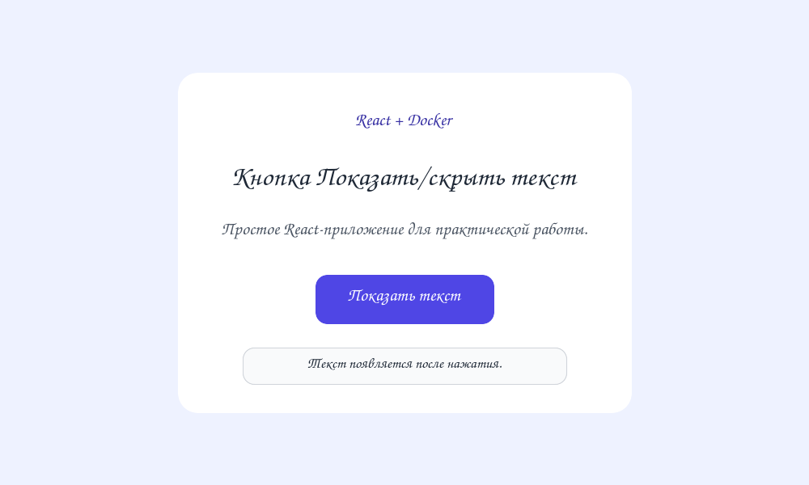

# Кнопка «Показать/скрыть текст»

Простое React-приложение для финальной практической работы по развёртыванию приложения в Docker.

В приложении есть кнопка. При нажатии на неё текст появляется, а при повторном нажатии скрывается. Логика реализована через `useState`.

## Скриншот приложения



## Запуск локально без Docker

```bash
npm install
npm start
```

После запуска приложение будет доступно по адресу:

```text
http://localhost:3000
```

## Сборка Docker-образа

```bash
docker build -t show-hide-text-app .
```

## Запуск контейнера

```bash
docker run -d -p 8080:80 --name show-hide-text-container show-hide-text-app
```

После запуска приложение нужно открыть в браузере по адресу:

```text
http://localhost:8080
```

## Проверка запущенного контейнера

```bash
docker ps
```

## Остановка и удаление контейнера

```bash
docker stop show-hide-text-container
docker rm show-hide-text-container
```

## Что используется в проекте

- React
- JavaScript
- CSS
- Docker
- nginx

## Структура проекта

```text
show-hide-text-docker/
├── public/
├── src/
│   ├── App.js
│   ├── App.css
│   ├── index.js
│   └── index.css
├── Dockerfile
├── .dockerignore
├── nginx.conf
├── package.json
└── README.md
```
